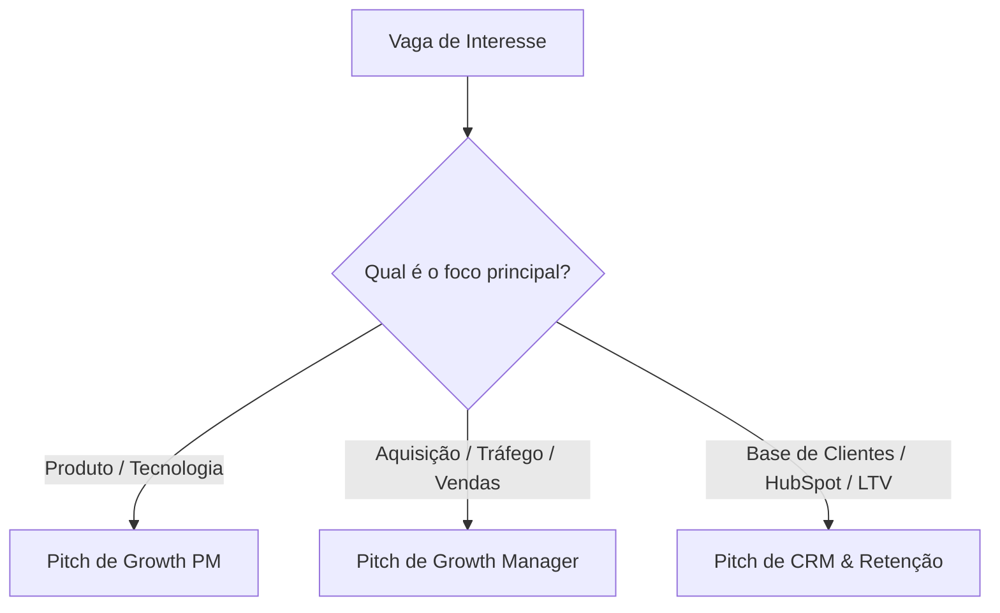

# Estratégia de Posicionamento e Recolocação - João Gobira

Seu perfil é extremamente rico e híbrido (Tech + Marketing + Dados + Produto). Nas entrevistas, o maior risco é o entrevistador te achar "generalista demais" ou não entender se você é um profissional de SEO, de mídia paga, de programação ou de produto. 

Para vencer nas entrevistas, você precisa de **clareza de nicho** e de **adaptar seu discurso para cada vaga**.

---

## 1. Diagnóstico do Perfil: Seus 3 Pilares de Ouro
1. **Tech & Dados:** Formação em Engenharia de Computação, domínio de SQL, Tableau e tracking técnico (Server-side, APIs de conversão).
2. **Growth & Marketing:** Mais de 10 anos de experiência real gerando milhões em faturamento, dominando SEO técnico, CRO, mídia paga (Meta/Google Ads) e automação de CRM (HubSpot).
3. **Negócios & Produto:** Pós-graduação em Digital Product Management (FIAP) e visão focada em LTV, Churn, P&L e CAC.

---

## 2. As Vagas com Maior Chance de Aprovação (Seus Alvos)

Você não deve se aplicar para vagas juniores ou focadas em apenas uma ferramenta (ex: "Analista de SEO operacional" ou "Gestor de Tráfego de nicho"). Seu foco são posições estratégicas e de liderança técnica.

### Alvo A: Growth Product Manager (GPM) / Product Manager (Foco em Growth ou Retenção)
*   **O que é:** O PM responsável por mover ponteiros de negócio (aquisição, ativação, receita, retenção) usando produto e experimentação.
*   **Por que você tem chances:** Você tem a base técnica (Engenharia) para falar com desenvolvedores e a base de growth/CRO para desenhar testes A/B e fluxos de PLG (Product-Led Growth).
*   **Termos de busca:** `Growth Product Manager`, `Product Manager Growth`, `PM de Growth`, `GPM`.

### Alvo B: Growth Manager / Coordenador / Specialist
*   **O que é:** O profissional que lidera a estratégia de tração de um produto/empresa ponta a ponta no funil.
*   **Por que você tem chances:** Você já fez isso na TagServer, Conexa, HostGator e Gestão 4.0. Você sabe rodar mídia, otimizar SEO de larga escala e automatizar CRM.
*   **Termos de busca:** `Growth Manager`, `Growth Specialist`, `Coordenador de Growth`, `Head de Growth`.

### Alvo C: Especialista em CRM, Retenção & LTV / E-commerce Growth Specialist
*   **O que é:** O guardião da base de clientes, responsible por aumentar a receita recorrente (LTV) e reduzir o cancelamento (churn).
*   **Por que você tem chances:** Especialista em HubSpot, histórico de funis perpétuos, foco em D2C/e-commerce (ADCOS, HostGator) e uso de Economia Comportamental.
*   **Termos de busca:** `Especialista em CRM`, `CRM Manager`, `LTV Specialist`, `Retention Manager`.

---

## 3. Estrutura de Aplicação Assertiva

Para cada vaga que você se candidatar, você deve usar um "Pitch" diferente. Veja como se posicionar na entrevista:

### 📋 Script de Posicionamento para Entrevistas

| Tipo de Vaga | O que falar na introdução da entrevista (Pitch) | Cases para citar |
| :--- | :--- | :--- |
| **Growth Product Manager** | *"Sou um profissional técnico com background em Engenharia e especialização em Gestão de Produto pela FIAP. Uso dados (SQL/Tableau) e experimentação (CRO/Testes A/B) para criar jornadas de produto que aceleram a aquisição e a retenção de usuários."* | • Programa Member Get Member (MGM) na Conexa. • Área de CRO com +53% de conversão na StartSe. • Calculadora de ROAS na TagServer. |
| **Growth Manager** | *"Atuo há quase 15 anos escalando operações digitais e e-commerce. Domino canais de aquisição de ponta a ponta (SEO de larga escala e mídia paga com R$ 1M+/mês), garantindo eficiência de P&L com redução de CAC e CPL."* | • Redução de CPL de R$ 20 para R$ 7 no Gestão 4.0. • Crescimento de tráfego de 300k para 900k na Conexa. • Crescimento de 44% em SEO YoY na ADCOS. |
| **Especialista em CRM / LTV** | *"Minha especialidade é maximizar o valor de vida do cliente (LTV) e diminuir o Churn. Sou especialista técnico em HubSpot e utilizo gatilhos de Economia Comportamental para criar réguas de relacionamento e automações de funil perpétuo."* | • Estruturação de CRM e automações na StartSe. • Automações de inbound e redução de churn no Gestão 4.0. • Gestão de CRM na HostGator. |

---

## 4. Plano de Ação Imediato

1.  **Ajuste o LinkedIn:** O seu título atual deve refletir os seus Alvos. 
    *   *Sugestão de Título:* `Growth Product Manager | Growth Specialist | Especialista em CRM & LTV | Tech & Data-Driven Growth`
2.  **Crie 3 versões do seu Currículo (PDF):**
    *   **Versão GPM:** Destaque a FIAP, Engenharia, metodologias ágeis, testes A/B, CRO e PLG.
    *   **Versão Growth Manager:** Destaque mídia paga, orçamentos liderados, SEO técnico, aquisição e P&L.
    *   **Versão CRM & LTV:** Destaque HubSpot, automações de funil, retenção, churn e e-commerce.
3.  **Filtro Assertivo de Vagas:** Só se candidate a vagas que peçam visão analítica (dados/SQL/CRO) ou estratégia multicanal. Evite vagas puramente operacionais de redação de conteúdo ou apenas configuração de anúncios.
