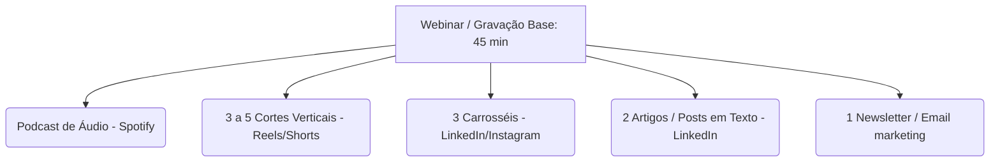

# Projeto Repurposing de Conteúdo: Do Webinar ao Carrossel

Este documento apresenta a estrutura operacional para transformar conteúdos em vídeo longo (Webinars, Lives, Podcasts) em uma máquina de distribuição multiformato, focando em atração e autoridade com especialistas de marketing, produto, CRM e e-commerce.

---

## 1. O Motor de Reaproveitamento (Repurposing Engine)

A estratégia consiste em gravar **1 conteúdo base (mãe)** e desmembrá-lo em **múltiplos ativos menores (filhos)** para maximizar o alcance e a eficiência de tempo.

### O Fluxo de Publicação e Produção

| Etapa | Responsável | Ação | Prazo Esperado |
| :--- | :--- | :--- | :--- |
| **1. Pauta & Agendamento** | Host (João) | Definição dos tópicos e alinhamento com convidado. | D-7 |
| **2. Gravação** | Host + Convidado | Gravação via StreamYard/Riverside (vídeo + áudio local). | Dia D |
| **3. Decupagem & Roteiros** | Coprodução / IA | Identificação de ganchos para cortes e roteirização dos carrosséis. | D+2 |
| **4. Edição & Design** | Designer / Editor | Criação dos criativos carrossel e edição dos cortes de vídeo. | D+4 |
| **5. Distribuição** | Social Media | Agendamento e publicação coordenada em todas as redes. | D+7 em diante |

---

## 2. Episódio Piloto: "Como as Marcas Estão Sendo Encontradas na Era da IA"
**Convidado:** Galba Trampo  
**Formato:** Bate-papo gravado (Webinar/Vídeo) — 40 a 50 min.

### Estrutura de Blocos e Roteiro de Perguntas

Para que a conversa tenha começo, meio e fim fluidos, agrupamos as perguntas sugeridas em 4 blocos temáticos:

#### Bloco 1: O Cenário Atual e a Nova Busca (10-12 min)
*O objetivo deste bloco é contextualizar o problema para quem ainda não entendeu o impacto das IAs na pesquisa diária.*
* **Pergunta 1:** Como você explicaria SEO, GEO e AEO para um executivo que ainda não acompanha essa discussão de inteligência artificial?
* **Pergunta 2:** O que muda na cabeça e no comportamento do consumidor quando ele deixa de buscar uma lista de links no Google e passa a receber uma resposta pronta de uma IA?
* **Pergunta 3:** O que significa ser "encontrável" quando a jornada de compra não começa mais necessariamente na barra de pesquisa tradicional?

#### Bloco 2: Desmistificando SEO, GEO e AEO na Prática (15 min)
*Foco técnico simplificado. Como as coisas funcionam sob o capô.*
* **Pergunta 4:** O que continua importante do SEO tradicional e o que começa a perder força ou virar fumaça a partir de agora?
* **Pergunta 5:** Como uma marca de verdade consegue aumentar suas chances de aparecer em respostas geradas pelo ChatGPT, Claude ou Google Gemini? (GEO - Generative Engine Optimization).
* **Pergunta 6:** Como dados de produtos estruturados, reviews de clientes e conteúdo técnico influenciam a descoberta nesses robôs hoje?

#### Bloco 3: Marca, Reputação e Métricas (10 min)
*Conectando a técnica ao impacto de negócios e a novas formas de medir sucesso.*
* **Pergunta 7:** Em um ambiente de respostas automatizadas pelas IAs, a força e a autoridade da marca passam a pesar mais do que antes?
* **Pergunta 8:** Como medir o sucesso das campanhas e do SEO quando o usuário pode ser influenciado pela resposta da IA sem sequer clicar e entrar no nosso site?
* **Pergunta 9:** Quais são os maiores erros que as empresas estão cometendo hoje ao tentar produzir conteúdo focando em Inteligência Artificial?

#### Bloco 4: Mercado LatAm, Riscos e Visão de Futuro (10 min)
*Conclusões de mercado e visão estratégica de longo prazo.*
* **Pergunta 10:** Como essa mudança afeta diretamente o varejo, a indústria e os marketplaces aqui na América Latina?
* **Pergunta 11:** Existe o risco real de as marcas perderem o relacionamento direto com seus clientes se esses intermediários inteligentes concentrarem toda a descoberta?
* **Pergunta 12:** Qual deve ser o primeiro movimento prático de uma empresa que quer se preparar para essa nova camada de busca?
* **Pergunta 13 (Encerramento):** Como você visualiza essa corrida tecnológica nos próximos 5 anos? O que era promessa que virou certeza e o que era certeza que virou fumaça?

---

## 3. Matriz de Repurposing: Roteiro dos Carrosséis

A partir deste bate-papo, criamos 3 modelos de criativos em formato carrossel. Eles traduzem o conteúdo técnico em insights rápidos e altamente visuais para o LinkedIn e Instagram.

### Carrossel 1 — O Fim do Link Azul: O que é SEO, GEO e AEO?
> **Objetivo:** Educar o mercado e gerar autoridade sobre o tema central.

* **Slide 1 (Capa):**  
  *Título:* O Google que você conhece está morrendo.  
  *Subtítulo:* Como as marcas serão encontradas a partir de agora? 🧐👇  
  *Apoio Visual:* Gráfico simples mostrando a transição de "Lista de Links" para "Resposta Direta de IA".
* **Slide 2 (O Problema):**  
  *Texto:* O usuário não quer mais 10 links azuis para ler e decidir. Ele quer a resposta pronta. Quem resume a internet para ele hoje são as IAs (ChatGPT, Claude, Gemini).
* **Slide 3 (A Transição):**  
  *Texto:* A busca mudou e a forma de otimizar também.  
  *Tabela comparativa rápida:*
    * **SEO:** Otimização para mecanismos de busca tradicionais (Google).
    * **GEO:** Otimização para motores gerativos (aparecer nas respostas de IA).
    * **AEO:** Otimização para respostas por voz/assistentes (respostas diretas e precisas).
* **Slide 4 (Como o GEO funciona):**  
  *Texto:* Para a IA te citar, você precisa de:  
    1. **Fontes confiáveis:** Citações em portais, blogs e wikis.  
    2. **Dados estruturados:** Deixar claro para a IA o que é seu produto.  
    3. **Linguagem direta:** Responder à intenção de busca, não apenas encher o texto de palavras-chave.
* **Slide 5 (CTA):**  
  *Texto:* Sua empresa já está olhando para GEO ou continua apenas no SEO tradicional? Salve este post para consultar depois e comente aqui sua opinião.

---

### Carrossel 2 — Como fazer sua marca aparecer no ChatGPT e Claude?
> **Objetivo:** Entregar um checklist ultra-prático de aplicação imediata.

* **Slide 1 (Capa):**  
  *Título:* Como "treinar" a Inteligência Artificial para achar a sua marca.  
  *Subtítulo:* 4 passos práticos para o ChatGPT e o Claude te recomendarem. 🤖💥
* **Slide 2 (O Segredo das IAs):**  
  *Texto:* As IAs não adivinham. Elas leem a internet e buscam padrões de confiança. Se ninguém fala da sua marca de forma estruturada, você simplesmente não existe para o algoritmo.
* **Slide 3 (Passo 1 & 2):**  
  *Texto:*  
    * **01. Force Menções com Contexto:** Consiga reviews e menções em sites do seu setor. O robô precisa cruzar dados para entender que você é especialista.  
    * **02. Use Dados Estruturados (Schema Markup):** Alimente o site com códigos que mostram claramente preços, avaliações e especificações técnicas de produto.
* **Slide 4 (Passo 3 & 4):**  
  *Texto:*  
    * **03. Crie Conteúdo Focado em Intenção:** Escreva respondendo a dúvidas complexas ("Como resolver X de forma rápida?"), não apenas termos soltos.  
    * **04. Construa Autoridade Real:** Menções em redes sociais e links de terceiros de alta qualidade pesam muito para a validação das IAs.
* **Slide 5 (CTA):**  
  *Texto:* Faça o teste: digite no ChatGPT pedindo indicações da sua categoria. Sua marca apareceu? Se não, comece a aplicar o checklist hoje. Curta se esse post te ajudou!

---

### Carrossel 3 — Zero Clique: As Novas Métricas de Sucesso no Marketing
> **Objetivo:** Chamar atenção de diretores e gerentes de marketing/e-commerce.

* **Slide 1 (Capa):**  
  *Título:* O fim do tráfego orgânico tradicional?  
  *Subtítulo:* Como medir o sucesso na era do "Zero Clique". 📈📉
* **Slide 2 (A Reality Cruel):**  
  *Texto:* Se a IA responde tudo na tela do usuário, ele não clica no seu site. O tráfego orgânico cai, mas a descoberta da marca continua acontecendo. Como provar o valor do seu conteúdo agora?
* **Slide 3 (Métricas Antigas vs. Novas):**  
  *Tabela comparativa:*
    * **Antes (SEO Clássico):** Posição no Google, Impressões, Cliques orgânicos.
    * **Agora (Descoberta por IA):** Share of Voice na IA (quantas vezes é citado), Sentimento da resposta, Menções de marca assistidas.
* **Slide 4 (O que acompanhar na prática):**  
  *Texto:*  
    1. **Brand Queries:** O volume de buscas diretas pela sua marca no Google (indica que o usuário viu você na IA e foi atrás).  
    2. **IA Share of Search:** Testes periódicos com prompts simulando a dor do cliente para ver qual marca é sugerida primeiro.  
    3. **Conversões Diretas:** Focar em conversões de canais proprietários (Newsletters, Comunidades, Directs).
* **Slide 5 (CTA):**  
  *Texto:* O marketing está mudando. Quem medir apenas cliques vai parecer que está falhando. Qual métrica você usa hoje? Compartilhe com aquele colega gestor.

---

## 4. Distribuição do Conteúdo Mãe (Exemplo de Grade Semanal Leve)

Para não sobrecarregar sua rotina, o modelo ideal após a gravação de **1 papo por semana** é distribuir apenas **3 posts semanais** (foco em qualidade e sustentabilidade):

* **Terça-feira (Lançamento Oficial):**
  * **O que publica:** Vídeo completo no YouTube + Áudio no Spotify.
  * **Divulgação:** Post curto no LinkedIn e Stories no Instagram apresentando o convidado e os 3 maiores aprendizados do episódio.
* **Quinta-feira (Aprofundamento Visual):**
  * **O que publica:** 1 Carrossel educativo (ex: *"O Fim do Link Azul: SEO vs GEO vs AEO"*) no LinkedIn e Instagram.
  * **Objetivo:** Reter a atenção de quem prefere ler rápido a assistir a um vídeo longo.
* **Sábado (Insight Rápido):**
  * **O que publica:** 1 Corte de Vídeo Vertical (60s) com a resposta mais impactante ou polêmica do convidado (Reels + Shorts + LinkedIn).
  * **Objetivo:** Chamar novos seguidores e gerar curiosidade para o link do episódio completo.

