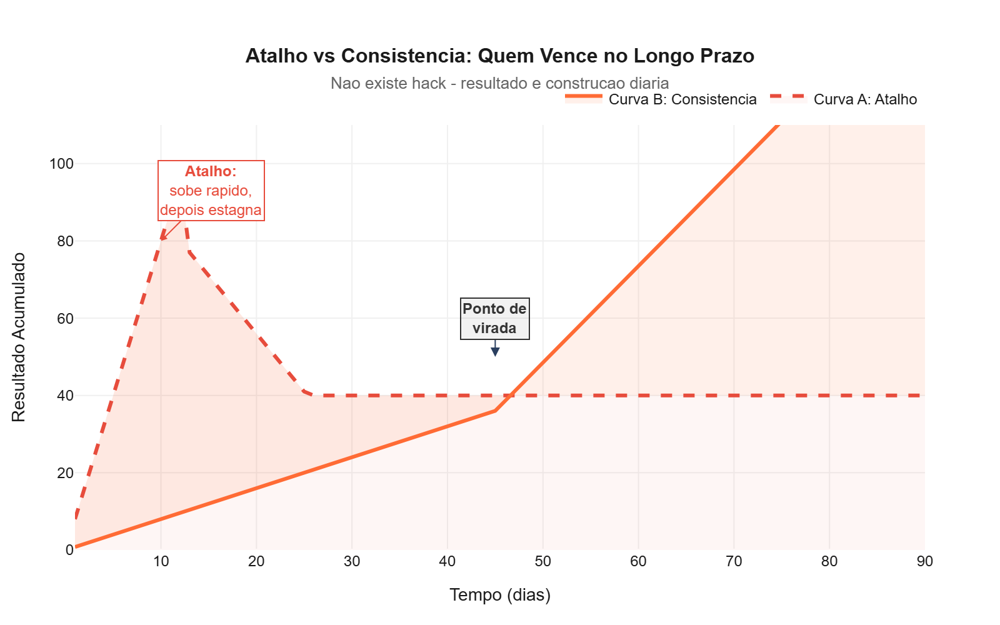

# Meu pai nunca me ensinou nada sobre marketing. Mas me ensinou tudo sobre liderança.

Meu pai nunca abriu o Google Analytics. Não sabe o que é CPL, ROAS ou funil de vendas.

Mas ele me ensinou absolutamente tudo o que eu precisava saber sobre liderança.

Nos últimos 15 anos, gerenciei milhões em verba de mídia, liderei times em mercados complexos e sentei na mesa com diretores e C-levels. E em todas as reuniões difíceis, a bússola que guiou minhas decisões não veio de um MBA. Veio do seu Adilson.

Três princípios que carrego dele para o trabalho:

---

## 1. A palavra é o maior contrato que existe

Meu pai é pedreiro. Não assina contrato com cláusulas. Quando ele diz que vai fazer um serviço, ele faz. Ponto.

"Promessa não é papel", ele me dizia. "É a sua palavra. E a sua palavra é tudo que você tem."

No mercado, vivemos cercados de desculpas: "ajuste de escopo", "imprevisto", "alinhamento interno". Mas no fundo, todo mundo sabe quando uma desculpa é só desculpa.

Se você disse que ia entregar na terça, entregue na terça. Não importa o que aconteça. Cumpriu? Você é confiável. Não cumpriu? Sua palavra perde valor - e recuperar confiança é 10x mais caro do que mantê-la.

Hoje, quando um profissional me entrega no prazo combinado, mesmo com dificuldades, esse profissional sobe no meu conceito mais do que aquele que entrega antes mas dá desculpas depois.

---

## 2. Liderar é proteger e assumir a bronca

Meu pai nunca foi do tipo que terceirizava a culpa. Se algo dava errado na obra, ele assumia: "Erro meu, não dele."

Ele me ensinou que **liderar é absorver**:

- O erro do time é seu
- A entrega atrasada é sua responsabilidade
- O lead que não converteu - você deveria ter treinado melhor

E o contrário também vale: quando o time acerta, o mérito é deles. Seu papel como líder foi criar as condições para o acerto acontecer.

Já vi gestores que jogam o time debaixo do ônibus na primeira reunião com a diretoria. Esses não duram. Times não seguem líderes que não os protegem.

**Imagem sugerida:** Uma ilustração conceitual de duas cenas. Cena 1 (errado): gestor apontando dedo para o time enquanto a diretoria observa. Cena 2 (certo): gestor de frente para a diretoria, protegendo o time que está atrás dele. A ilustração comunica visualmente "absorver a bronca vs. terceirizar a culpa".

---

## 3. O trabalho duro não aceita atalhos

Não existe "hack".

Essa foi a lição mais difícil de engolir, porque passei anos procurando o atalho. O curso que ia me transformar em especialista. A ferramenta que ia automatizar tudo. O truque que ia fazer o tráfego explodir da noite para o dia.

Não existe.

Existe **suor, suor e mais suor até dar certo**. Você faz o básico bem feito, todos os dias, com consistência cega, até que aquilo pareça fácil para quem vê de fora.

Meu pai nunca usou a palavra "consistência". Mas viveu ela.

Acordar 5h da manhã para ir para obra, 30 anos seguidos, em chuva ou sol, doente ou saudável - isso não é sorte. Não é talento. É **construção diária**.

No marketing, é a mesma coisa. O profissional que publica conteúdo todo santo dia, que testa criativo todo santo dia, que otimiza campanha todo santo dia - esse profissional não depende de "insight genial". Ele constrói resultado no tempo.

---

## O que fica

Você pode ler 100 livros de gestão. Fazer 3 MBAs. Assistir 50 cursos no LinkedIn Learning.

Mas o caráter você não aprende em página de PDF.

O que meu pai me deu não está em currículo: é a noção de que liderança não é cargo. É responsabilidade. Não é poder. É serviço.

Hoje, quando entro em uma reunião difícil, penso: **o que seu Adilson faria?**

E a resposta é quase sempre a mesma: cumprir o combinado, proteger o time, e trabalhar duro sem reclamar.

Três princípios simples. Uma vida inteira de prática.

---

*Qual foi o maior ensinamento que você trouxe de casa para o trabalho?*
